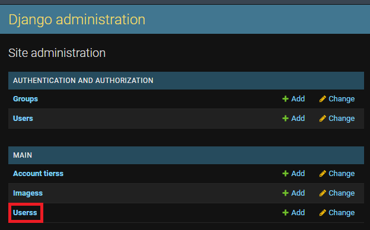
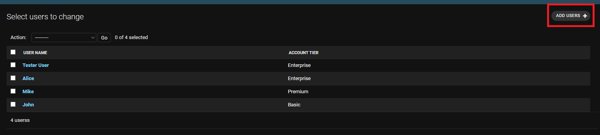
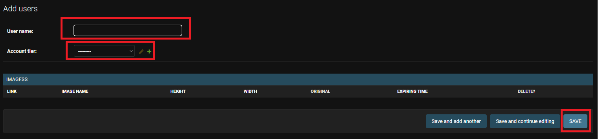
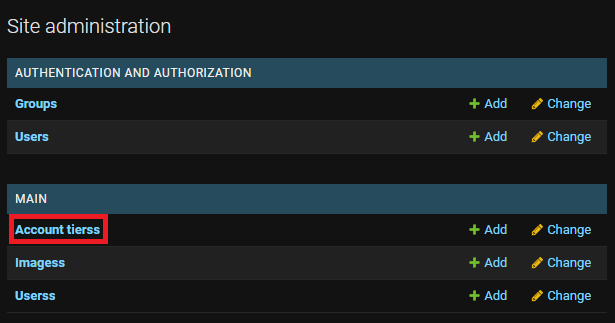
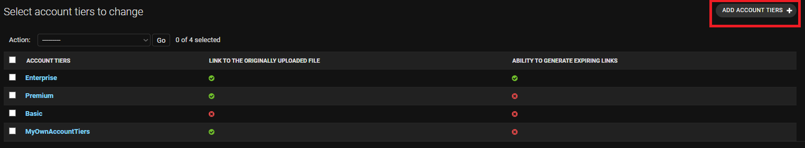
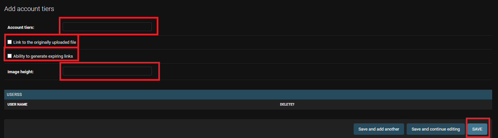
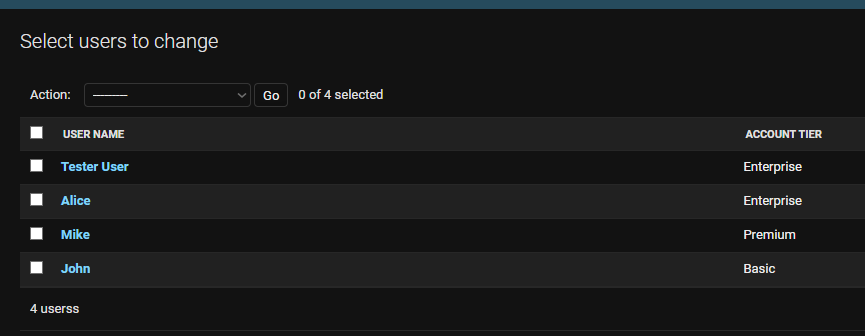
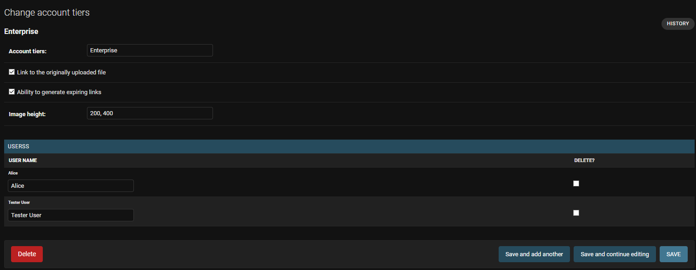

#Image upload based on django

#API capabilities

### Upload image
Upload image in base64 format for users created on the database side

In the response, you will get links to graphics relevant to the given account tiers

### Get user image
Get all links for specific user relevant to his account tiers

### Generate expiring link
Generate an expiring link to binary graphics if your account level allows it

# Quickstart

## Clone repository
`git clone https://github.com/WiktorBoro/rock-paper-scissors.git`

## Install the libraries
`pip install -r requirements.txt`

## Create superuser to access the database 
`python manage.py createsuperuser`

fill in the required fields

## Go to manage.py location
Run

`python manage.py runserver`

### Start celery worker 

for windows

`celery -A image_upload worker -l info --pool=solo`

and for macs

`celery -A image_upload worker -l info`

## Go to your local host 
http://127.0.0.1:8000/

####There is a swagger on the homepage with skinned information about api.

####The rest of the api information is in the views.py file

## Go to admin page

http://127.0.0.1:8000/admin/

Login with previously created 'superuser' login data

## To create new user go to

Fill in the fields below and save

You have created a new user and can use it in API!

## To create new account tiers

Fill in the fields below and save
### IMPORTANT graphic height values available for this account tiers must be integer listed after a decimal point for example: 200,400,500,600

You have created a new account tier, and you can assign a user to it

# Users view

from the user's database perspective, you can see all the graphics that belong to him.

You can also in a quick way see what account tiers the users have

# Account tiers view

from the account tier database perspective, you see which users have a given account tier